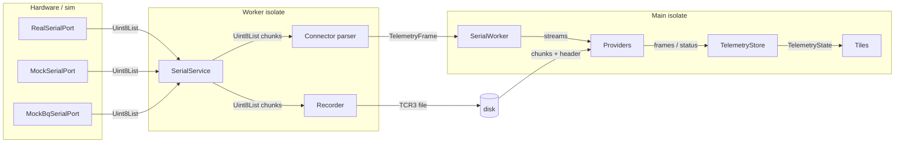
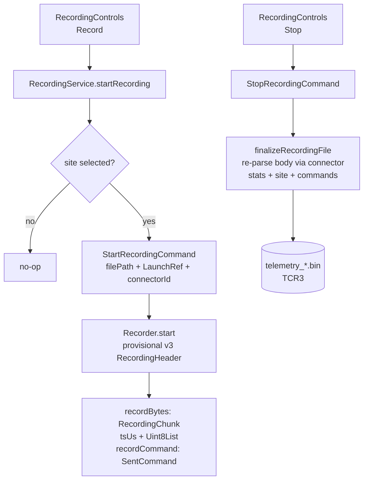
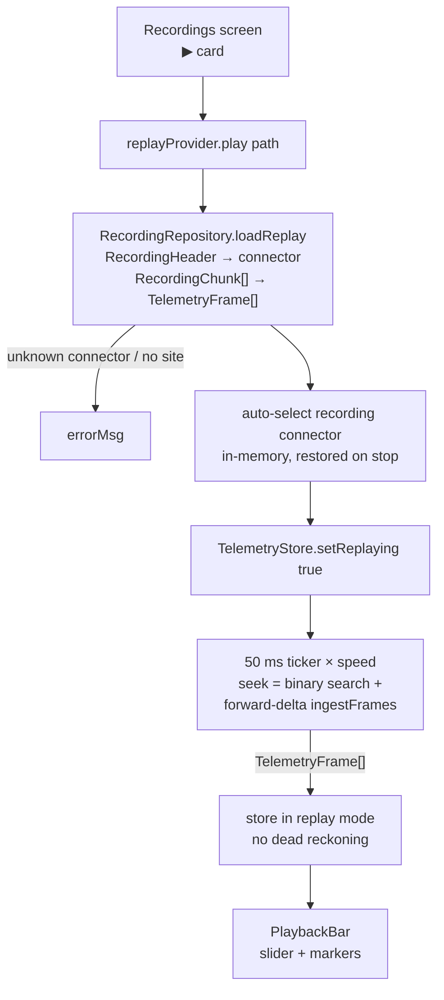
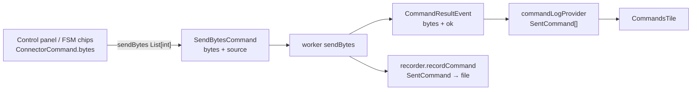
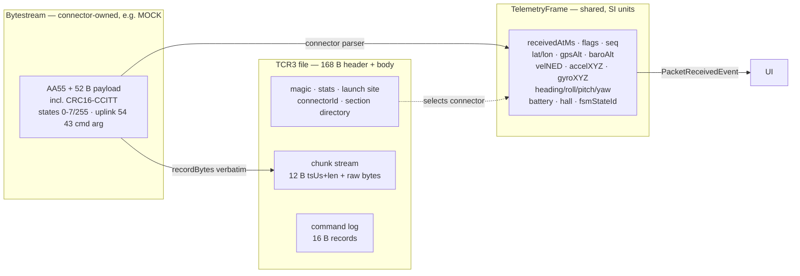

# Data Flow

Raw bytes never leave `packages/serial`. The UI only deals in `TelemetryFrame`.

## Layers



Files: [real.dart](../packages/serial/lib/hardware/real.dart) · [mock.dart](../packages/serial/lib/hardware/mock.dart) · [mock_bq.dart](../packages/serial/lib/hardware/mock_bq.dart) · [serial.dart](../packages/serial/lib/serial.dart) (`SerialService`) · [worker.dart](../packages/serial/lib/worker/worker.dart) (`workerMain`) · [manager.dart](../packages/serial/lib/worker/manager.dart) (`SerialWorker`) · [protocol.dart](../packages/serial/lib/worker/protocol.dart) · [telemetry_store.dart](../lib/state/telemetry_store.dart)

## Live: bytestream → tile

```mermaid
flowchart TD
    A["Serial port\nCOMx / MOCK / MOCK-BQ"] -- "Uint8List" --> B[SerialService.byteStream]
    B -- "Uint8List" --> C{workerMain\nper chunk}
    C -->|1| D["Recorder.recordBytes\nUint8List + 12 B stamp"]
    C -->|2| E["connector.createParser().feed()\nUint8List → TelemetryFrame[]"]
    E -->|drop| F["counters\n→ LinkStats"]
    E -->|keep| G["PacketReceivedEvent\nTelemetryFrame"]
    G --> H["SerialWorker.frameStream\nStream TelemetryFrame"]
    H --> I["telemetryStreamProvider"]
    I -- "TelemetryFrame" --> J["TelemetryStore.ingest\nskip if replaying"]
    J --> K["history ring 9000\n+ dead reckoning"]
    K -- TelemetryState --> L[tiles]
    E -.->|"LinkStatsEvent\nmax 1 per 250 ms\n+ 500 ms heartbeat" .-> M[LinkStats consumers]
```

- 250ms throttle: stats go out at most 4 Hz per chunk burst; the 500ms heartbeat forces one even with no traffic, so the UI graphs decay to zero instead of freezing.
- `LinkStatsEvent` is link health only: cumulative byte counters (`totalBytes`, `matchedBytes`, `garbageBytes`, `crcErrorBytes`, `matchedPackets`, `crcErrors`). All rocket data travels in `PacketReceivedEvent` → `TelemetryFrame`.
- Rocket data itself is never throttled or dropped: the worker forwards every decoded frame immediately, live `ingest()` stores + notifies per frame, replay batches each 50 ms tick into one rebuild with zero drops. (`TelemetryStore.notifyThrottled`, 80 ms, is currently uncalled.)
- Files: [worker.dart](../packages/serial/lib/worker/worker.dart) · [recorder.dart](../packages/serial/lib/io/recorder.dart) · [connector.dart](../packages/serial/lib/connectors/connector.dart) · [telemetry_provider.dart](../lib/state/telemetry_provider.dart) · [channel_health_provider.dart](../lib/state/channel_health_provider.dart)

## Recording: live → file



Files: [recording_provider.dart](../lib/state/recording_provider.dart) · [recorder.dart](../packages/serial/lib/io/recorder.dart) · [recording_file.dart](../packages/serial/lib/io/recording_file.dart) · [sent_command.dart](../packages/serial/lib/telemetry/sent_command.dart)

## Playback: file → tile



Files: [recording_repository.dart](../lib/services/recording_repository.dart) · [replay_controller.dart](../lib/state/replay_controller.dart) · [file_parser.dart](../packages/serial/lib/io/file_parser.dart) · [flight_trim.dart](../lib/services/flight_trim.dart) (trim/preview)

## Uplink: tile → rocket



Files: [rocket_commands.dart](../packages/serial/lib/telemetry/rocket_commands.dart) · [control_panel_tile.dart](../lib/ui/tiles/control_panel_tile.dart) · [commands_tile.dart](../lib/ui/tiles/commands_tile.dart)

## Formats



Files: [frame_codec.dart](../packages/serial/lib/telemetry/frame_codec.dart) · [telemetry_frame.dart](../packages/serial/lib/telemetry/telemetry_frame.dart) · [recording_file.dart](../packages/serial/lib/io/recording_file.dart) · [mock_connector.dart](../packages/serial/lib/connectors/mock_connector.dart) · [registry.dart](../packages/serial/lib/connectors/registry.dart)
