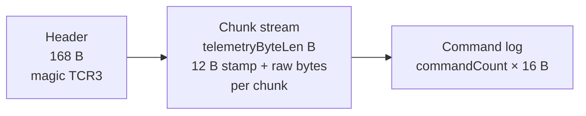
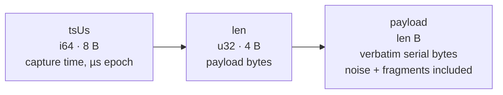
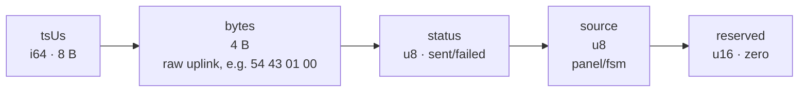
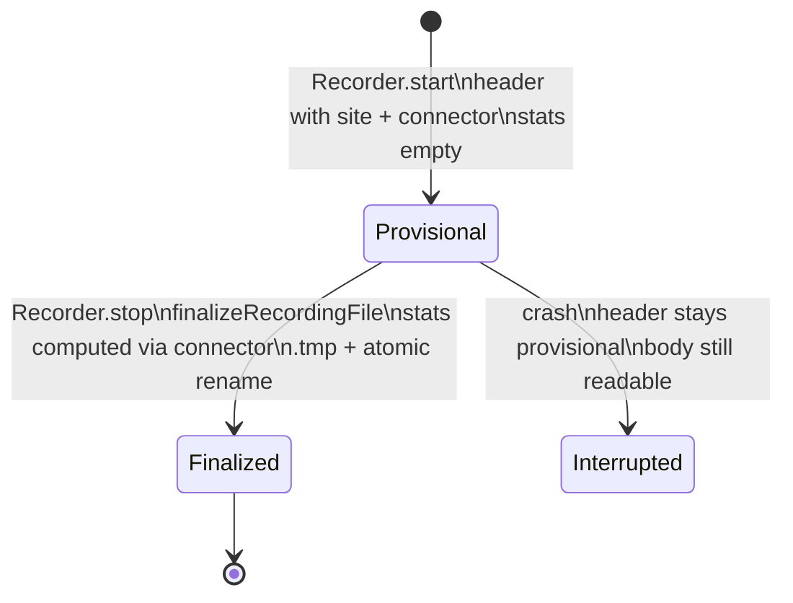
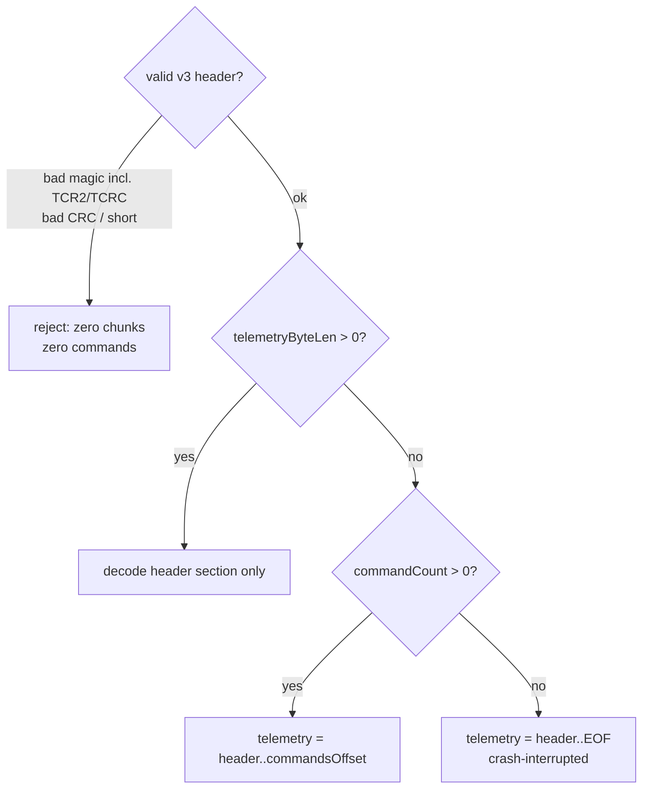
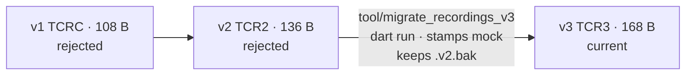

# Save File Format (`*.bin`, v3)

All integers big-endian. CRC16-CCITT everywhere (poly `0x1021`, init `0xFFFF`).

## Overall layout

- Chunk bodies are the recording connector's raw bytestream; `connectorId` selects the parser.
- Files live in `Documents/TryCatch/recordings/telemetry_YYYY-MM-DD_HH-MM-SS.bin`.

## Header (168 B)

| Off | Size | Field | Type | Notes |
|-----|------|-------|------|-------|
| 0 | 4 | magic | u32 | `0x54435233` (`TCR3`) |
| 4 | 2 | payloadLength | u16 | Wire framing, 52 for mock |
| 6 | 2 | flags | u16 | bit0 = site present, bit1 = stats present |
| 8 | 8 | startMicros | i64 | First chunk timestamp, µs epoch |
| 16 | 8 | endMicros | i64 | Last chunk timestamp |
| 24 | 8 | packetCount | u64 | Valid decoded frames |
| 32 | 4 | maxBaroAltM | f32 | Peak baro altitude, m AGL |
| 36 | 4 | maxSpeedMps | f32 | Peak total speed, m/s |
| 40 | 4 | maxAccelMps2 | f32 | Peak total accel, m/s² |
| 44 | 4 | launchLat | i32 | 1e-7 degrees |
| 48 | 4 | launchLon | i32 | 1e-7 degrees |
| 52 | 4 | launchMslM | f32 | Site altitude, m MSL |
| 56 | 48 | launchName | u8[48] | UTF-8, NUL-padded |
| 104 | 2 | headerCrc | u16 | Over bytes 0..103 |
| 106 | 2 | reserved | u16 | Zero |
| 108 | 2 | headerLength | u16 | Always 168 |
| 110 | 2 | formatVersion | u16 | Always 3 |
| 112 | 8 | telemetryByteLen | u64 | Chunk-stream bytes |
| 120 | 8 | commandsOffset | u64 | Absolute offset of command log |
| 128 | 4 | commandCount | u32 | 16-byte records following |
| 132 | 2 | directoryCrc | u16 | Over 108..131 + 134..167 |
| 134 | 2 | reserved | u16 | Zero |
| 136 | 32 | connectorId | u8[32] | UTF-8, NUL-padded, e.g. `mock` |

## Chunk anatomy

- Chunks are raw stream fragments, **not** one frame each — reassembly via the connector parser.
- Corrupt chunk (absurd length, truncation) stops the read; prior chunks stay valid.

## Command record (16 B)

- Labels resolve at display time via the connector's catalog — renames never invalidate files.

## Lifecycle: provisional → finalized

- Empty sessions (no chunks) stay 0-byte files.
- Finalize never throws and is idempotent; failures leave the file untouched.

## Reader fallback

- `payloadLength` is informational; the connector owns framing.
- Unknown `connectorId` → playback refuses with an error, preview decodes nothing.

## Versions

Files: [recording_file.dart](../packages/serial/lib/io/recording_file.dart) · [recorder.dart](../packages/serial/lib/io/recorder.dart) · [file_parser.dart](../packages/serial/lib/io/file_parser.dart) · [sent_command.dart](../packages/serial/lib/telemetry/sent_command.dart) · [recording_provider.dart](../lib/state/recording_provider.dart) · [recording_repository.dart](../lib/services/recording_repository.dart)
