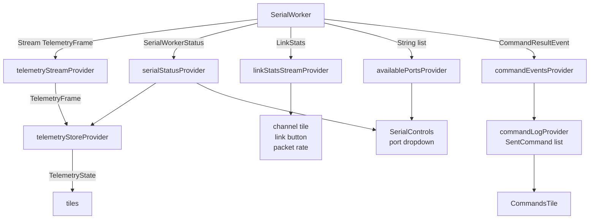
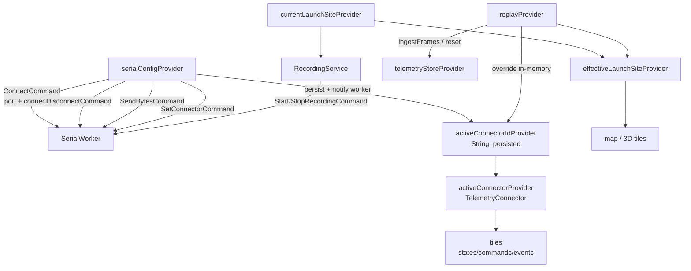
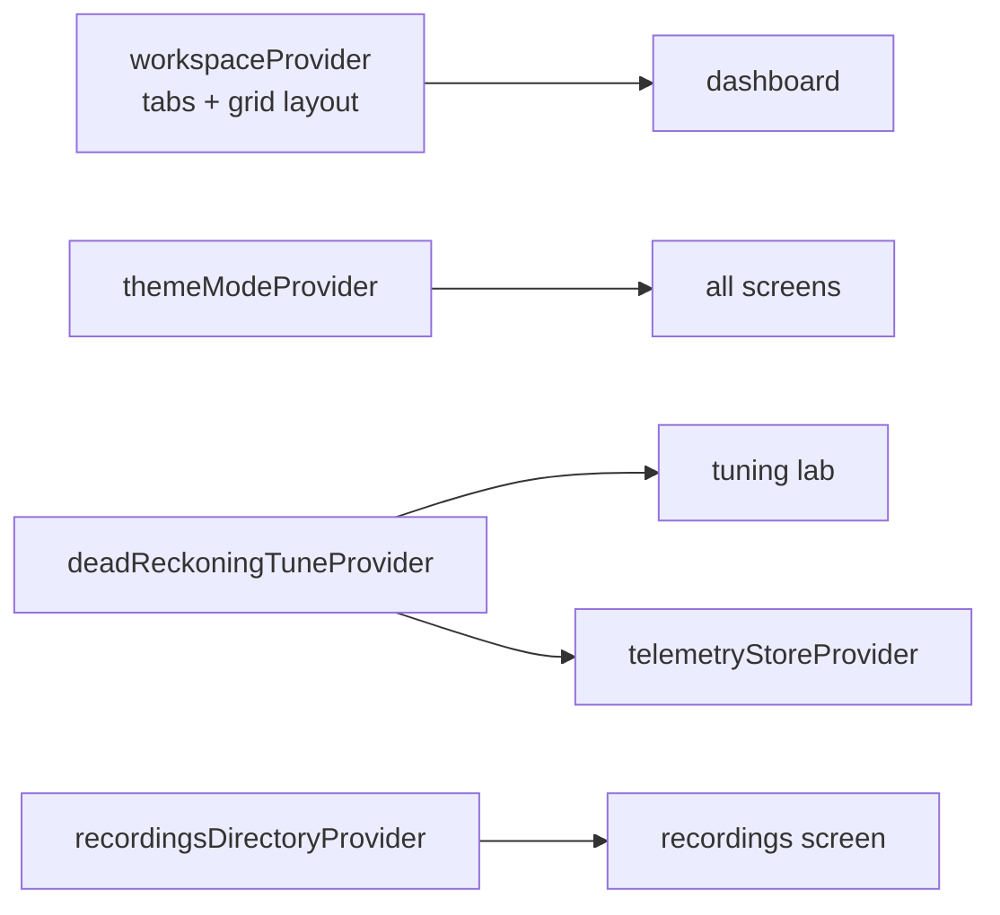
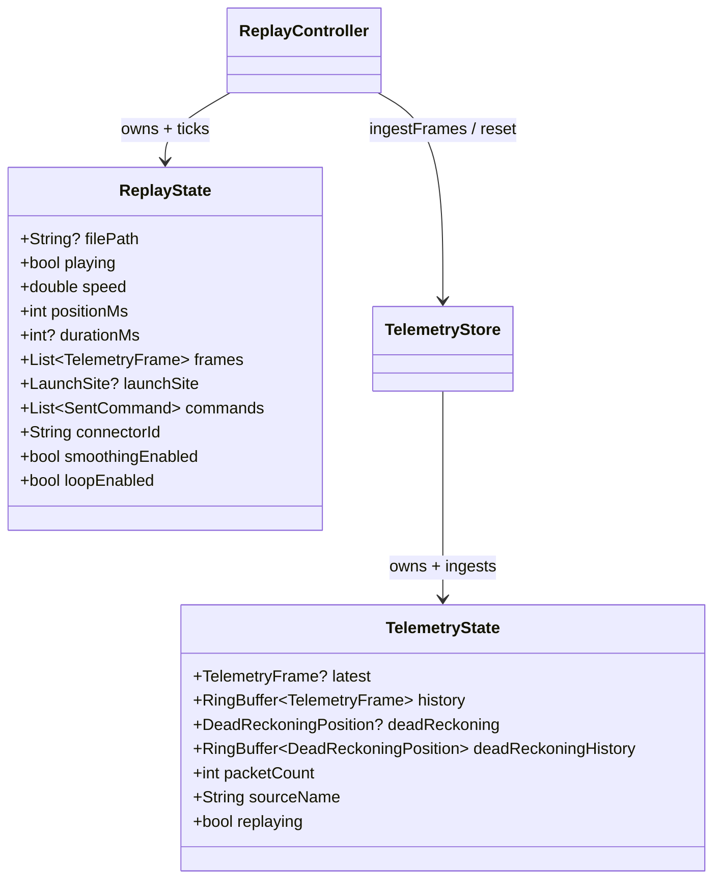
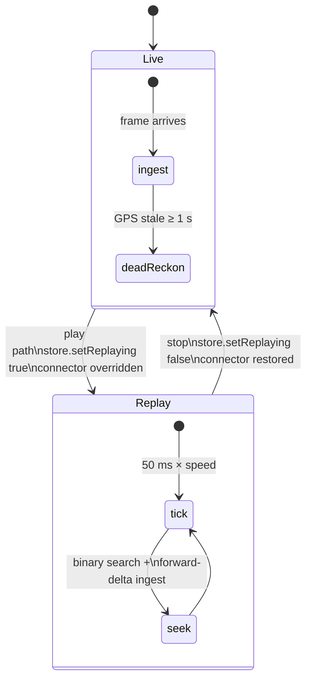
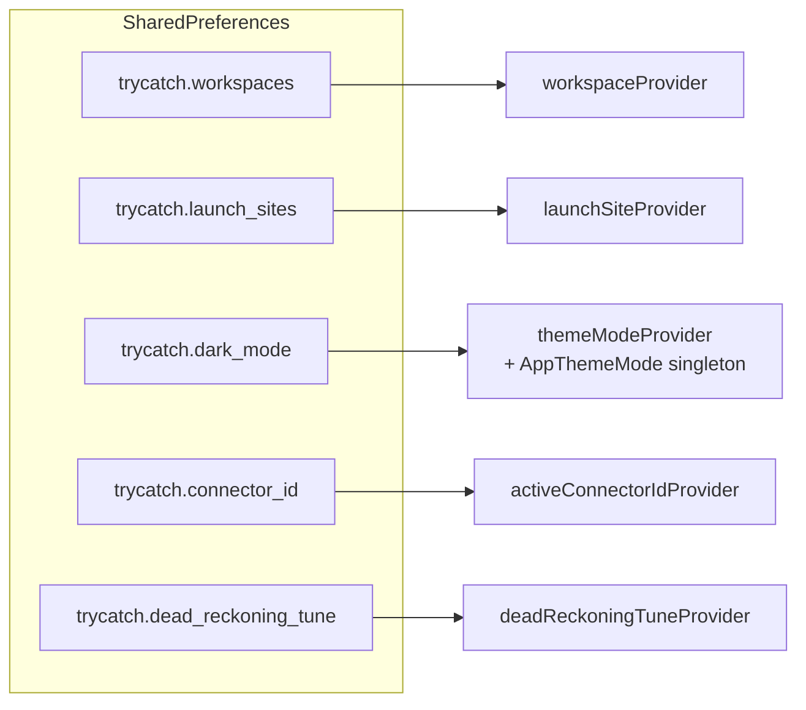

# State

Riverpod, no codegen. `main.dart` overrides `serialWorkerProvider` with the spawned isolate handle.

## Live telemetry state: worker → store → tiles

Files: [manager.dart](../packages/serial/lib/worker/manager.dart) · [telemetry_provider.dart](../lib/state/telemetry_provider.dart) · [telemetry_store.dart](../lib/state/telemetry_store.dart) · [channel_health_provider.dart](../lib/state/channel_health_provider.dart) · [main.dart](../lib/main.dart)

## Session control: connect · record · replay

Files: [telemetry_provider.dart](../lib/state/telemetry_provider.dart) · [connector_provider.dart](../lib/state/connector_provider.dart) · [recording_provider.dart](../lib/state/recording_provider.dart) · [replay_controller.dart](../lib/state/replay_controller.dart) · [launch_site_store.dart](../lib/state/launch_site_store.dart)

## App chrome: layout · theme · tuning

Files: [workspace_controller.dart](../lib/state/workspace_controller.dart) · [theme_mode_provider.dart](../lib/state/theme_mode_provider.dart) · [dead_reckoning_tune_store.dart](../lib/state/dead_reckoning_tune_store.dart)

## TelemetryState vs ReplayState

Files: [telemetry_store.dart](../lib/state/telemetry_store.dart) · [replay_controller.dart](../lib/state/replay_controller.dart)

## Live vs replay mode

- Live stream is ignored while `replaying`.
- Dead reckoning is live-only; replay shows the recorded GPS track as-is.
- `seek()` forward ingests the delta, backward resets + replays from 0.

## Persistence

- No version suffixes on keys; corrupt values fall back to defaults, never crash.
- Everything else (telemetry, replay cursor, command log) is in-memory only.

Files: [prefs_keys.dart](../lib/services/prefs_keys.dart)
